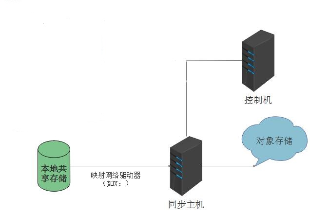
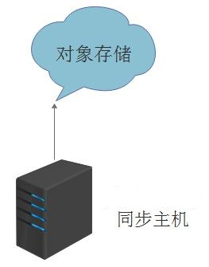

# DTO 简介

## i2DTO 概述

传统的 NAS 存储是基于文件系统的，在大数据时代面对海量文件时，存储容量和访问速度成为传统存储的瓶颈。
而面向对象存储优势在于它是与网络连接的设备，不需要文件系统的介入，具有一定的智能，能够自动管理其上的数据分
布，它提供的性能是目前其他存储结构很难达到的。直接通过URL 进行访问，访问速度快，另外有很好的可扩展性、安全性。

为了解决传统存储的问题i2DTO应运而生，将传统NAS 存储上的数据迁移至面向对象存储或本地存储（localFS）
上，还可通过i2DTO 映射更新文件迁移后的访问地址。

2.0 以后的版本新增支持LocalFS->对象存储，对象存储->对象存储之间的比较与同步。

3.0 以后版本支持Linux 同步主机。

目前i2DTO 支持的存储类型有：LocalFS；AWS S3；S3 Compatible；Aliyun OSS；Baidu BOS；MS Azure File；MS Azure Blob；Jingdong OSS。

注： **青云、美团云、天翼云、华为云均选择S3 Compatible 类型；腾讯云cos 选择AWS S3 类型。**

## i2DTO 主要功能

i2DTO 主要功能是数据迁移和备份：

1. 将传统NAS 存储上的数据迁移至面向对象存储或本地存储上；
2. 将对象存储上的数据还原到同步主机的本地存储；
3. 本地存储、对象存储到对象存储的比较与同步。

i2DTO 的同步规则可以实现数据的准实时同步和定时同步，准实时同步可以做
到分钟级的延迟同步。

## i2DTO 部署模式

i2DTO 包括：同步主机，控制机。

### 模式一：同步主机独立部署模式

该模式i2DTO 同步主机（dto-syncer）部署在独立的服务器上来访问生产机
的共享存储，并在同步主机上将生产机的共享映射为网络驱动器，通过同步主机
把数据备份到目标存储上，此部署方式适合大规模使用情
况，控制机可与同步主机部署在同一台机器上，也可独立部署，如下图：

### 模式二：生产机自身存储同步模式

当小规模使用i2DTO，生产机只有一台机器，需要同步的数据在生产机的本地存储上时：

此时可把同步机(dto-syncer)直接部署在生产机上，如果数据量较大，建议控制机单独部署；

### 模式三：多个同步主机部署模式

在模式一的基础上，可以部署多个同步机，分别进行各自的同步任务。

## 详细说明

* [对象存储](../resource_management/dto_storage.md)
* [DTO主机](../resource_management/dto_sync_host.md)
* [DTO规则](dto_rule.md)