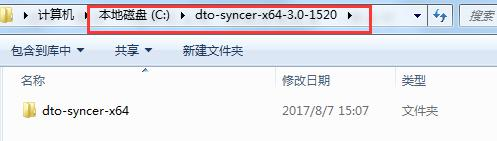
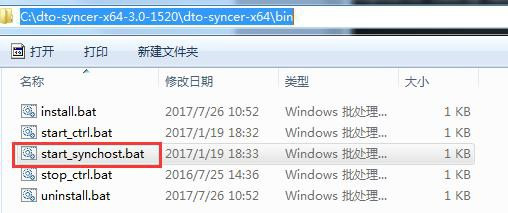
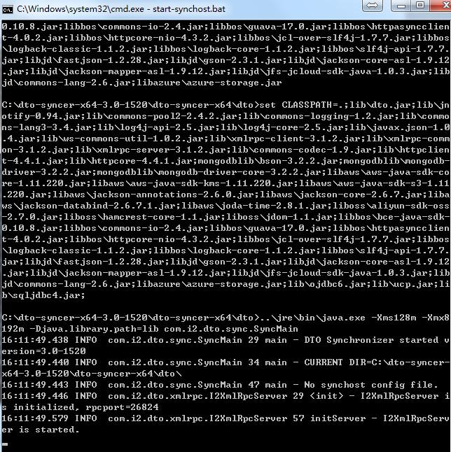
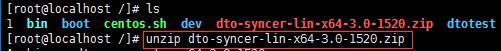
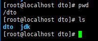
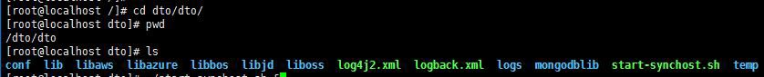
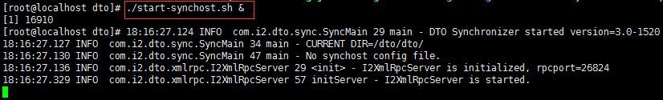

# i2DTO 软件安装

## Windows 同步主机安装

1. 将安装包 dto-syncer-x64-3.0-1520.zip 上传至同步主机，解压：

本例中解压至：

2. 同步主机上进入 C:\\dto-syncer-x64-3.0-1520\\dto-syncer-x64\\bin 目录，双击start\_synchost.bat 运行即可：

**注意：start\_synchost.bat 必须以映射网络磁盘的用户身份运行，不一定是管理员；**

**（规则日志在 C:\\dto-syncer-x64-3.0-1520\\dto-syncer-x64\\dto\\logs\\目录下）**

## Linux 同步主机安装

1. 将安装包 dto-syncer-lin-x64-3.0-1520.zip 上传至同步主机，unzip 解压：

本例中 upzip 默认解压至运行 unzip 命令的当前路径的 dto/目录下：

2. 同步主机上进入 dto/dto/目录，./start\_synchost.sh & 运行即可：

**要求运行程序的用户对需同步数据中的：文件有\[读\]权限，目录有\[读+执行\]权限。**

**（规则日志在 dto/dto/logs/目录下）**
