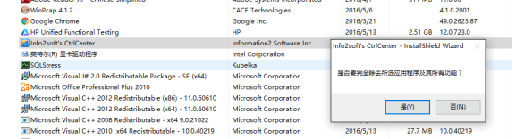
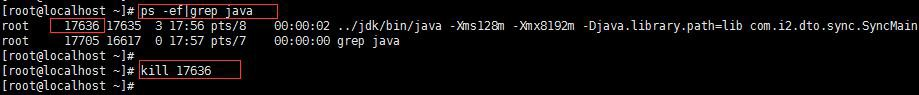

## i2软件卸载 {#i2}

### Windows卸载 {#windows}

通过开始菜单-&gt;控制面板-&gt;添加/删除程序，找到对应安装软件，双击之后即可完成卸载，以i2控制机为例：

需要注意的是：卸载i2node后会保留工作机或灾备机等配置信息文件；卸载i2控制机后会保留apache配置文件及Postgresql数据库文件，如无保留的必要性请手动删除。

### Linux卸载 {#linux}

打开终端或者是SSH方式连接到服务器，通过如下rpm -e命令进行相关卸载，以i2node为例：

\[root@localhost ~\]\# rpm -e info2soft-ctrlcenter-7.x.x-xxxx.el7.i386

需要注意的是：卸载i2node后会保留工作机或灾备机等配置信息文件；卸载i2控制机后会保留apache配置文件及

Postgresql数据库文件，如无保留的必要性请手动删除。

### DTO 主机卸载

#### 关闭Windows 同步主机的 synchost 进程

如果要关闭Windows 同步主机上的synchost 服务，即不再使用同步主机模块， 关闭同步主机上 start\_synchost.bat 的运行窗口即可。

#### 关闭Linux 同步主机的 synchost 进程

如果要关闭 Linux 同步主机上的 synchost 进程：

1. 查询 synchost 进程 pid：ps -ef\|grep java

2. kill pid 杀死进程

