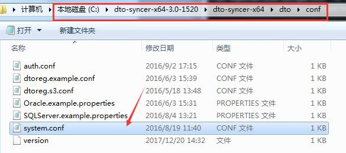

## 端口列表

| 主机角色 | 端口 | 协议 | 监听端口 | 备注 |
| :--- | :--- | :--- | :--- | :--- |
| 工作机 | RPC服务端口 | TCP | 26821 | 控制机-&gt;工作机 |
|  | HA服务端口 | TCP | 26868 | 高可用控制及仲裁 |
|  | HA心跳端口 | TCP | 26850 | 高可用心跳 |
|  | I2NAS数据同步端口 | TCP | 26871 | 工作机->同步主机，i2NAS文件列表同步端口 |
| 灾备机 | RPC服务端口 | TCP | 26821 | 控制机-&gt;灾备机 |
|  | 镜像端口 | TCP | 26832 | 工作机-&gt;灾备机 |
|  | 复制端口 | TCP | 26833 | 工作机-&gt;灾备机 |
|  | 恢复端口 | TCP | 26831 | 工作机-&gt;灾备机 |
|  | SQLServer数据库备份端口 | TCP | 26834 | 工作机-&gt;灾备机， SQLServer数据库备份端口|
|  | HA服务端口 | TCP | 26868 | 高可用控制及仲裁 |
|  | HA心跳端口 | TCP | 26850 | 高可用心跳 |
|  | I2NAS命令控制端口 | TCP | 26873 | 工作机-&gt;灾备机，I2NAS命令控制端口|
|  | Oracle数据库备份端口 | TCP | 26876 | 工作机-&gt;灾备机， Oracle数据库备份端口|
| DTO同步主机 | RPC 服务端口  | TCP | 26824 | 控制机->同步主机 |
| 控制机 | HTTP端口 | TCP | 58080 | HTTP端口 |
|  | HTTPS端口 | TCP | 58086 | HTTPS端口 |
|  | I2Node Proxy端口 | TCP | 58082 | I2Node Proxy端口 |
|  | Active Proxy端口 | TCP | 26803 | Active Proxy端口 |


## 通信矩阵

|I2企业版全系列产品通信矩阵||||||||||||
|:--|:--|:--|:--|:--|:--|:--|:--|:--|:--|:--|:--|
|访问(源)端|IP|源端端口||目标端|目标端口|协议|端口作用（用途）<br/>对应服务/进程||认证方式|加密方式|是否允许修改|
|Bowser|不固定|随机(1024~65535)||控制机|58080/58086|http/https|用途：web管理控制台Server服务端口<br/>服务/进程：nginx||口令密码|SSL|配置文件可修改|
|控制机|固定|随机(1024~65535)||工作机/灾备机|26821|tcp|用途：rpc服务端口<br/>服务/进程：rpcserver||无（非控制入口）|无|i2port.conf可修改|
||固定|随机(1024~65535)||DTO同步主机|26824|tcp|用途：rpc服务端口<br/>服务/进程：synchost||无（非控制入口）|无|system.conf可修改|
|工作机|固定|随机(1024~65535)||灾备机|26832|tcp|用途：镜像端口<br/>服务/进程：srepd||无（非控制入口）|无|i2port.conf可修改|
||固定|随机(1024~65535)||灾备机|26833|tcp|用途：复制端口<br/>服务/进程：srepd||无（非控制入口）|无|i2port.conf可修改|
||固定|随机(1024~65535)||灾备机|26831|tcp|用途：恢复端口<br/>服务/进程：srepd||无（非控制入口）|无|i2port.conf可修改|
||固定|随机(1024~65535)||仲裁节点|26868|tcp|用途：高可用仲裁<br/>服务/进程：i2Avalability||无（非控制入口）|无|i2port.conf可修改|
||固定|随机(1024~65535)||灾备机|26850|tcp|用途：高可用心跳<br/>服务/进程：i2Avalability||无（非控制入口）|无|i2port.conf可修改|
|灾备机|固定|随机(1024~65535)||仲裁节点|26868|tcp|用途：高可用仲裁<br/>服务/进程：i2Avalability||无（非控制入口）|无|i2port.conf可修改|
||固定|随机(1024~65535)||工作机|26850|tcp|用途：高可用心跳<br/>服务/进程：i2Avalability||无（非控制入口）|无|i2port.conf可修改|


## 端口可配（自定义端口号）

需要修改端口的可以增加一个i2port.conf文件；Windows路径：安装目录\etc\i2port.conf, linux: /etc/sdata/i2port.conf

```
rpc = 26821              #RPC服务端口
mir_port = 26832         #镜像端口
recover_port = 26831     #恢复端口
rep_port = 26833         #复制端口
ha_arbit_port = 26868    #HA仲裁节点开放端口
cc_web_port = 58080      #控制机的开放端口
cc_proxy_port = 58082    #控制机Proxy端口，企业版里没有

```

相应地，控制机端口如果修改的话，需要新增i2cc.conf

Windows位置:安装目录\etc\i2cc.conf, Linux: /etc/sdata/i2cc.conf
```
cc_proxy_port=58082          #代理监听端口for工作机； 同i2port.conf中的cc_proxy_port
```
`cc_web_port` 就是HTTP/HTTPS端口，可以再apache配置的文件中修改。

DTO 同步主机端口自定义

位置:安装目录/dto/conf/system.conf

```
rpcport=26824
```

