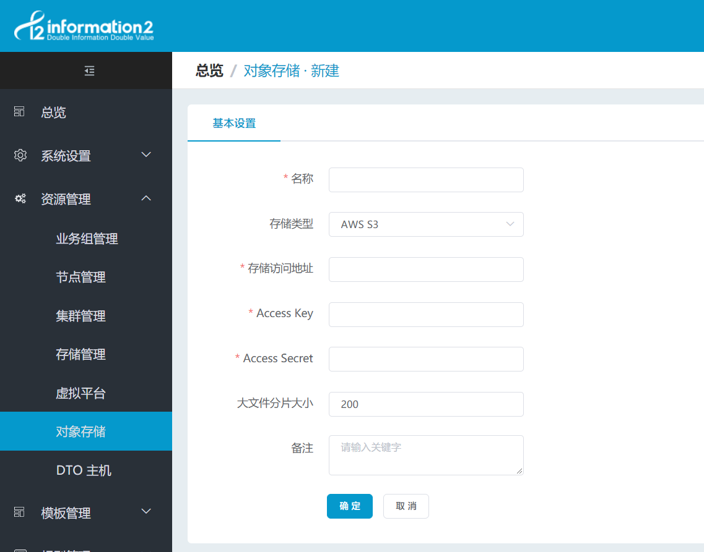
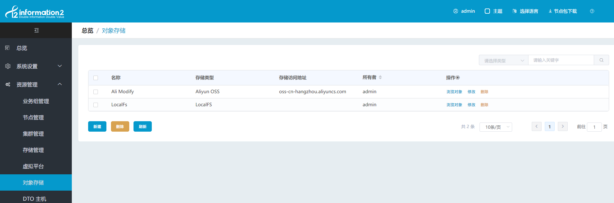
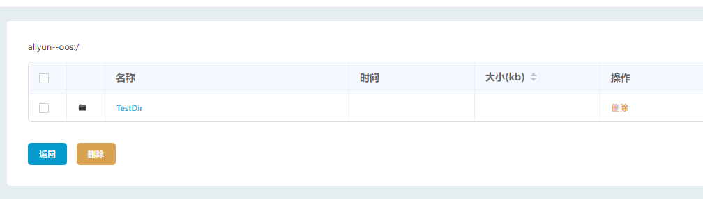

## 对象存储配置

### LocalFS 本地存储

点击"数据同步 - 对象存储"，进入对象存储页面，需要用户首先添加一个 LocalFS 存储，即同步主机的本地存储：

### 新建对象存储

在"数据同步 - 对象存储"界面，点击"新建对象存储"，如下进行配置：

1. 名称：对象存储名称自定义，便于管理即可；

2. 存储类型：支持 AWS S3；S3 Compatible ; Aliyun OSS；Baidu BOS；MS Azure File； MS Azure Blob；Jingdong OSS.

    **注：青云，美团云，天翼云，华为云的对象存储请选用"S3 Compatible"类型； 腾讯云的对象存储请选用"AWS S3"类型。**

3. 存储访问地址：需要去查找相关对象存储的帮助文档，本文档附录中整理了部分，可供参考，详见 **[对象存储endpoint](../appendix/dto_endpoint.md)**。

4. Access Key，Access Secret：需要用户自己登陆对象存储账户，在控制台生成；

5. 大文件分片大小：默认值为：200MB

    **注：Aliyun OSS 该值最小为 1，其余对象存储该值最小为 5，最大值为 5000 超过该值 5 倍的文件会被分片上传。规定大文件分片数量最大不能超过 10000；所以此值需要结合上传的数据量来设置 。比如上传数据中最大的文件大小为 100G，那么大文件分片大小最小应设为 100000M/10000=10M。**

### 对象存储的主界面说明

对象存储主界面显示如下：

1. 名称、存储类型、存储访问地址：显示的对象存储的配置；

2. 操作_浏览对象：可以查看对象存储上的所有存储桶，点击进入存储桶可以浏览和删除目录和文件：

    

3. 操作_修改配置：**修改关联了同步主机的对象存储信息，不影响当前正在运行的规则；当同步主机重新提交后再启动的规则才会使用新的对象存储信息；**

4. 操作_删除：点击可删除对应的对象存储。
