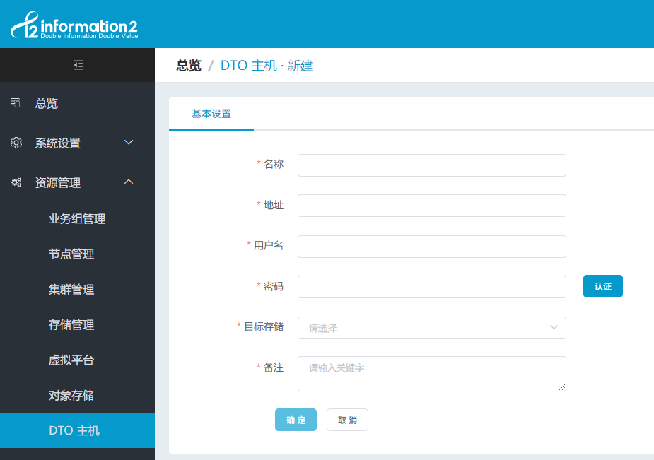
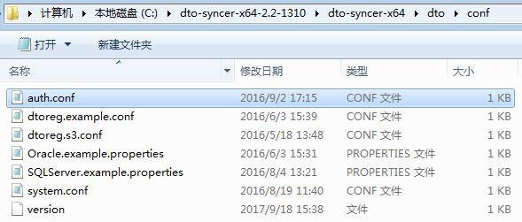
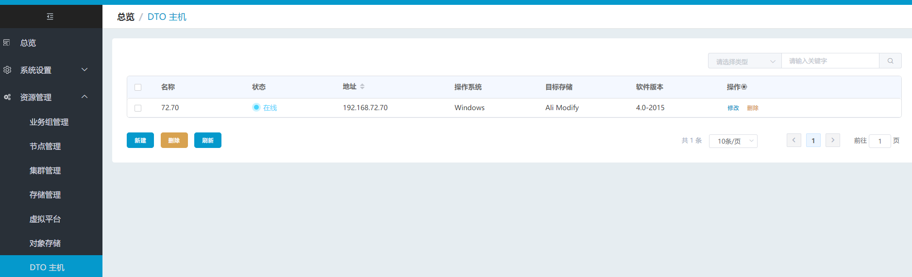

## DTO同步主机配置

点击"数据同步 - 同步主机 - 新建同步主机"，进入同步主机配置页面：



1. 名称：同步机名称自定义，便于管理即可；

2. 地址：部署同步主机机器的 IP 地址；

3. 用户名和密码：

   1. 默认用户名：exampleuser，默认密码：examplepass，并非机器的系统用户和密码。；

   2. 可参照以下步骤修改同步主机的认证用户名和密码：

       1. Windows 同步主机上进入 dto-syncer-x64\\dto\\conf 目录.
       2. Linux 同步主机上进入 dto/dto/conf 目录。
       3. 修改 auth.conf 文件，修改默认的 exampleuser 和 examplepass，用于新建同步主机认证时需要填写的认证用户名和认证密码：

            

            ```
            username = exampleuser
            secret = examplepass
            ```

6. 目标存储：选择要将本地数据同步到哪个存储上，下拉框中会列出"数据同步 - 对象存储"中已有存储以供选用.

## 同步主机的主界面说明

同步主机主界面显示如下：



1. 名称、地址、目标存储：显示的同步主机的配置；

2. 状态：在线/离线

    1. 在线：dto-syncer 服务正常运行中；

    2. 离线：dto-syncer 服务未开启；

3. 操作系统：显示同步主机的操作系统：Windows/Linux；

4. 版本：显示 dto-syncer 的版本号；

5. 操作_修改配置：当存在正在运行的同步规则时不允许修改；

6. 操作_删除：当存在与同步主机关联同步规则时不允许删除；
