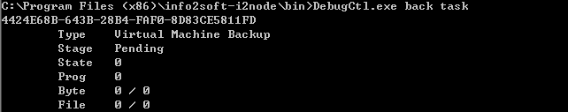
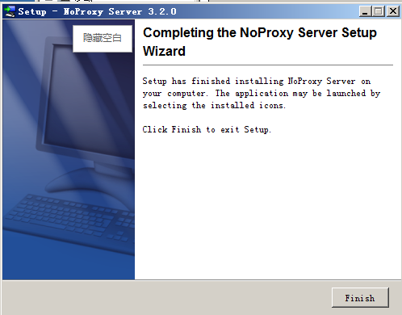

## Npserver安装 {#npserver}

### Windows安装 {#windows}

双击安装程序包，出现如下界面，点击next：

选中“I accept the agreement”,点击next：

安装完成后确认Npsvr服务是否处于运行状态，并确认版本号信息。

**注意：**

Npsvr默认使用端口58083与esxi的web service通信，确保npsvr所使用的端口可以被防火墙放行。

### Windows卸载 {#windows-0}

开始-&gt;所有程序-&gt;NoProxy Server,双击Npsvr自带卸载程序NoProxy Server Uninstaller，也可从控制面板中找到对应软件卸载，以用NoProxy Server Uninstaller卸载程序举例，页面如下：

点击Next：

**注意：**

卸载Npsvr后会保留一些配置信息文件；如无保留的必要性请手动删除。

### 灾备机部署VDDK动态库 {#vddk}

Windows平台下，软件安装完成后，停止软件所有服务，解压缩vddk文件到i2node\bin目录下，有冲突的文件选择覆盖。导入注册表项verifysslcertificates.reg以禁用ssl，启动软件所有服务。

linux平台下，软件安装完成后，停止软件i2node服务，解压vddk.tgz下的*so文件到/usr/lib/vmware-vix-disklib/目录下，编辑/etc/init.d/i2node，在启动服务进程的代码前面(比如加在”prog=i2node”的下一行)加入export LD_LIBRARY_PATH=/usr/lib/vmware-vix-disklib/(可以写成别的路径，但要和前面的路径保持一致)，启动i2node服务。

注：提供的vddk只支持64bit，所以备机只能是64位的系统